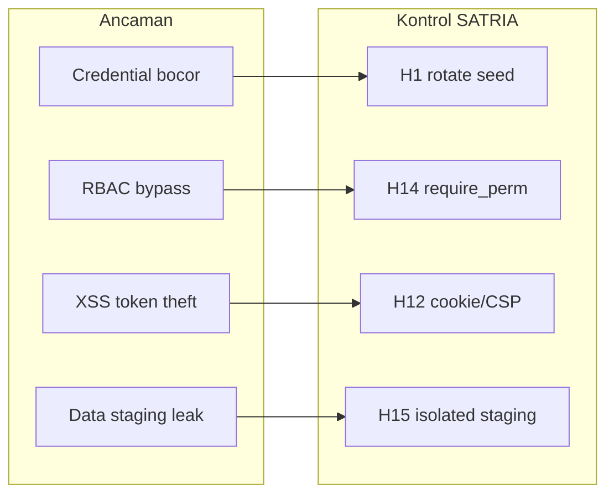

# SATRIA — Checklist Hardening (PoC → Produksi)

Panduan naik tingkat dari **lab localhost** ke **deploy terkontrol** (LAN panitia / server GPU).  
**Status baseline PoC (Agustus 2026):** RBAC API + UI selaras, bcrypt, rate-limit login, media ticket TTL, pytest 315+, E2E smoke 5 skenario.

Gunakan bersama [`AUDIT_PLAN.md`](AUDIT_PLAN.md) (fungsional) dan [`RUNNING.md`](RUNNING.md) (operasional).

---

## Cara pakai

1. Centang tiap item saat selesai (`☐` → `☑`).
2. Urutan disarankan: **P0 wajib** sebelum expose ke jaringan selain loopback → **P1 pilot** → **P2 compliance**.
3. Setiap blok ada **Verifikasi** — command atau tes manual singkat.

Legenda kolom **Sudah (PoC)**:

| Simbol | Arti |
|--------|------|
| ✅ | Sudah ada di codebase PoC |
| ⚠️ | Partial / cukup lab saja |
| ❌ | Belum / harus dikerjakan |

---

## P0 — Wajib sebelum keluar localhost

### P0.1 Secret & akun

| # | Item | Sudah (PoC) | Tindakan | Verifikasi |
|---|------|:-----------:|----------|------------|
| H1 | Ganti password seed semua role | ⚠️ | Set `SATRIA_SEED_*_PASSWORD` **sebelum** first boot DB prod; atau rotate via admin setelah deploy | Login dengan password lama gagal |
| H2 | Nonaktifkan re-seed otomatis di DB yang sudah hidup | ✅ | Pastikan seed hanya jalan saat tabel `users` kosong (`auth.py`) | DB prod punya user → restart → hash tidak berubah |
| H3 | Dokumentasi credential di repo | ⚠️ | Hapus password dari slide/demo publik; simpan di vault panitia | Audit grep `Ops@2026` di artefak deploy |
| H4 | Matriks role frozen | ✅ | Review `PERMISSIONS` di `backend/app/services/auth.py` + smoke `test_rbac.py` | `pytest backend/tests/test_rbac.py -q` |

### P0.2 Jaringan & binding

| # | Item | Sudah (PoC) | Tindakan | Verifikasi |
|---|------|:-----------:|----------|------------|
| H5 | API bind loopback default | ✅ | Prod: `SATRIA_API_HOST=127.0.0.1` + reverse proxy TLS | `ss -lntp` / `curl` dari host lain ditolak |
| H6 | CORS origins eksplisit | ⚠️ | Set `cors_origins` hanya origin UI prod (`config.py`) | Preflight dari origin asing → blocked |
| H7 | HTTPS termination | ❌ | Nginx/Caddy di depan UI + API; HSTS di edge | Browser bar gembok; no mixed content |
| H8 | Firewall | ❌ | Hanya port 443 (dan 22 jump) terbuka | Scan nmap dari subnet tamu |

### P0.3 Auth & sesi

| # | Item | Sudah (PoC) | Tindakan | Verifikasi |
|---|------|:-----------:|----------|------------|
| H9 | Token bearer DB-backed + expiry 12h | ✅ | Prod: pertimbangkan 8h + idle timeout | Token expired → 401 |
| H10 | Logout invalidasi token | ✅ | `POST /auth/logout` | Token lama tidak bisa `/auth/me` |
| H11 | Rate limit login | ✅ | PoC: 8/60s per IP+user in-memory; prod: Redis/shared store | Brute force → 429 |
| H12 | Token di `localStorage` | ⚠️ | Risiko XSS; P1: httpOnly cookie + CSRF atau short-lived + refresh | Review CSP + audit XSS surface |
| H13 | Redirect URL ilegal (RBAC UI) | ✅ | `useConsoleNavigation` | Operator ketik `/temuan` → redirect `/operator` |
| H14 | RBAC API setiap endpoint | ✅ | `require_perm` di `backend/app/api/v1/*` | Operator `GET /findings` → 403 |

### P0.4 Data sensitif

| # | Item | Sudah (PoC) | Tindakan | Verifikasi |
|---|------|:-----------:|----------|------------|
| H15 | Staging sesi terisolasi per session_id | ✅ | Backup encrypted volume; retention policy | Path staging tidak world-readable |
| H16 | Media via ticket TTL | ✅ | `media_access.py` — review `TICKET_TTL_SECONDS` | Ticket expired → 403 |
| H17 | ZIP upload size cap | ✅ | `SATRIA_ZIP_MAX_MB` | Upload > cap → 413/400 |
| H18 | SQLite WAL backup | ❌ | Cron snapshot `poc.db` + staging; test restore | Restore drill 1x |
| H19 | Enkripsi disk at-rest | ❌ | LUKS / volume encrypted cloud | BitLocker/LUKS aktif |

---

## P1 — Pilot produksi (1–2 minggu)

### P1.1 Observabilitas & audit

| # | Item | Sudah (PoC) | Tindakan | Verifikasi |
|---|------|:-----------:|----------|------------|
| H20 | Structured HTTP log + request_id | ✅ | Ship ke file/ELK; retain 90 hari | Correlate 1 request end-to-end |
| H21 | Audit trail otorisasi laporan | ⚠️ | Pastikan `AuditTrailPanel` + DB persist lengkap | Authorize → entry immutable |
| H22 | Log auth events (login fail/success) | ⚠️ | Tambah event di `auth.py` login | SIEM alert brute force |
| H23 | Health tanpa leak secret | ✅ | `/health` no stack trace | JSON tidak ada path internal |

### P1.2 Frontend hardening

| # | Item | Sudah (PoC) | Tindakan | Verifikasi |
|---|------|:-----------:|----------|------------|
| H24 | CSP header | ❌ | `default-src 'self'`; nonce scripts | Report-only → enforce |
| H25 | Build prod tanpa source map publik | ⚠️ | `vite build` — disable sourcemap deploy | DevTools Sources kosong |
| H26 | Dependency audit | ❌ | `npm audit` + `pip-audit` di CI | No critical open |
| H27 | E2E per role expanded | ⚠️ | Extend `frontend/e2e/console.spec.ts`: review, authorize | `npx playwright test` hijau |

### P1.3 Backend & pipeline

| # | Item | Sudah (PoC) | Tindakan | Verifikasi |
|---|------|:-----------:|----------|------------|
| H28 | Satu sesi aktif / mutex akuisisi | ⚠️ | Verifikasi di orchestration; dokumentasi ops | Dua start paralel → satu ditolak |
| H29 | Agent token TTL | ✅ | `android_agent_token_ttl_s` (default 3600) | Agent expired → re-bootstrap |
| H30 | Simulated / lab_demo off prod | ⚠️ | `SATRIA_LAB_DEMO_MODE=0`, no `force_simulated` | Health tidak menawarkan sim |
| H31 | File upload MIME + path traversal | ⚠️ | Review ZIP extract + media `relative_path` | Fuzz `../etc/passwd` → 400 |
| H32 | Postgres migration (opsional) | ❌ | Ganti SQLite jika multi-user concurrent | Load test 5 analis parallel |

### P1.4 Operasional

| # | Item | Sudah (PoC) | Tindakan | Verifikasi |
|---|------|:-----------:|----------|------------|
| H33 | `.env` tidak di git | ✅ | Secret manager / env file 600 | `git log -- .env` kosong |
| H34 | Docker non-root | ❌ | USER directive di Dockerfile | `docker exec whoami` ≠ root |
| H35 | Resource limits compose | ❌ | `mem_limit`, GPU reservation | OOM tidak bunuh host |
| H36 | Runbook incident | ❌ | Doc: cancel sesi, clear staging, rotate token | Drill 30 menit |

---

## P2 — Compliance & skala

| # | Item | Tindakan |
|---|------|----------|
| H37 | SSO/LDAP | Integrasi identity panitia; hapus seed demo |
| H38 | MFA admin | TOTP untuk `admin` / `pimpinan` |
| H39 | RBAC granular per case | Scope sesi per unit kerja |
| H40 | Chain-of-custody export | Hash manifest laporan PDF + timestamp |
| H41 | Data retention & wipe | Auto-purge staging N hari; sertifikat penghapusan |
| H42 | Penetration test | External audit forensik + OWASP ASVS L2 |
| H43 | HA / DR | API stateless; DB replica; RPO/RTO defined |

---

## Regresi wajib (setiap release)

Jalankan sebelum tag release atau demo panitia:

```bash
# Backend
cd backend && .venv/bin/python -m pytest -q

# Frontend unit + build
cd frontend && npm run test && npm run build

# E2E (backend + npm run dev harus hidup)
cd frontend && PLAYWRIGHT_BASE_URL=http://127.0.0.1:5173 npx playwright test
```

**Gate minimum:** 0 fail pytest, 0 fail vitest, build OK, E2E 5/5.

---

## Quick wins (≤1 hari) — **implemented Agustus 2026**

| # | Item | Artefak |
|---|------|---------|
| ✅ | E2E review + authorize | `frontend/e2e/flows.spec.ts`, `helpers.ts` |
| ✅ | Backup DB + staging | `backend/scripts/backup_lab_data.py` |
| ✅ | TLS reverse proxy | `deploy/nginx/satria.tls.conf`, `docker-compose.prod.yml` |
| ✅ | CORS whitelist env | `SADT_CORS_ORIGINS` di `config.py` |
| ✅ | Rotate password | `backend/scripts/rotate_lab_passwords.py` |
| ✅ | Auth audit log | `login_success` / `login_failed` di `auth.py` |
| ✅ | Authorize API guard | `reports.py` + `test_authorize_blocked_until_review_complete` |
| ✅ | Build tanpa sourcemap | `vite.config.ts` `sourcemap: false` |

Jalankan E2E workflow (managed backend port 8012 + DB isolasi `/tmp/satria-e2e-data`):

```bash
cd frontend && npx playwright test
```

Tanpa `PLAYWRIGHT_BASE_URL` — Playwright start backend+UI otomatis.

---

## Mapping risiko → kontrol



---

## Referensi kode

| Area | Path |
|------|------|
| RBAC & login | `backend/app/services/auth.py` |
| CORS | `backend/app/main.py`, `backend/app/core/config.py` |
| Media ticket | `backend/app/services/media_access.py` |
| UI route guard | `frontend/src/app/hooks/console/useConsoleNavigation.ts` |
| Token storage | `frontend/src/shared/api/http.ts` |
| RBAC tests | `backend/tests/test_rbac.py`, `frontend/src/app/rbac.smoke.test.ts` |
| E2E | `frontend/e2e/console.spec.ts` |
| Env template | `.env.example` |

---

## Sign-off produksi (template)

| Peran | Nama | Tanggal | P0 | P1 |
|-------|------|---------|:--:|:--:|
| Dev lead | | | ☐ | ☐ |
| Ops / infra | | | ☐ | ☐ |
| Pengawas panitia | | | ☐ | ☐ |

**Catatan release:** _________________________________
